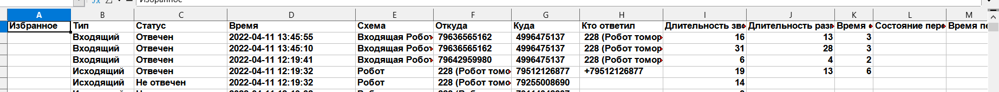
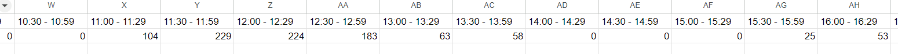

## Статистика звонков по временным интервалам
### На входе две таблицы с информацией по роботу автопрозвонщику и статистикой по звонкам

На выходе информация с табуляцией такого формата

В 1-й строке интервал
Во 2-й строке количество звонков в этом интервале